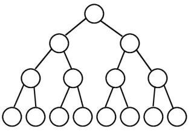

非线性结构
--
- 非线性结构包括
  - 树
  - 图
  - 堆
  - 散列表

**树:**
 * 树作为一种树状结构的数据结构，其数据节点之间的关系也如大树一样，将有限个节点根据不同层次关系进行排列，从而形成数据与数据之间的父子关系。常见的树的表示更接近与倒挂的树，因为他将根朝上，页朝下。
    >
 * 树的特点:
    * 每个节点有0个或者多个子节点
    * 没有父节点的节点称为根节点
    * 每一个非根节点有且只有一个父节点
    * 除了根节点外，每个子节点可以分为多个不相交的子树
    * 右子树永远比左子树大，读取顺序从左到右
 * 平衡二叉树:
   * ...
